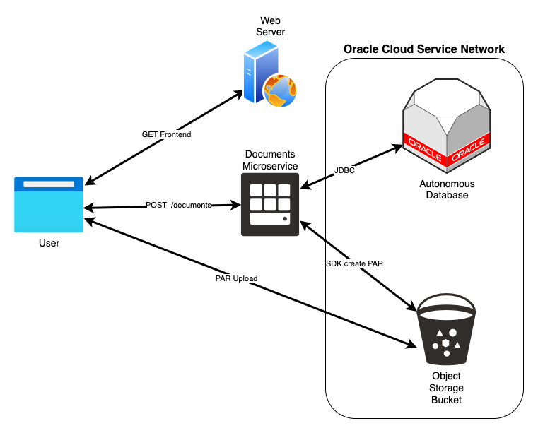

# Upload to OCI Object Storage directly from your Web

Uploading to Oracle Cloud Object Storage directly from your web.

## Why

As a user I want to upload pictures, PDF or any file into the system

Traditionally, the user would upload the file to the backend server that is responsible for upload the file to storage (Object Storage in this case).

This solution avoids the overhead on the backend server by creating a pre-authenticated request on Object Storage with an expiration time to enable the browser or mobile up to upload directly into Object Storage.

## Diagram

This is how it looks like:

Keep in mind you can use [Oracle API Gateway](https://www.oracle.com/cloud-native/api-gateway/) and [Oracle Functions](https://www.oracle.com/cloud-native/functions/) to perform this same process.

## How

This is a two steps process:

- Request Pre-Authenticated Request (PAR) to Oracle Cloud Object Storage.
- Use the PAR to upload the file directly from the frontend.
